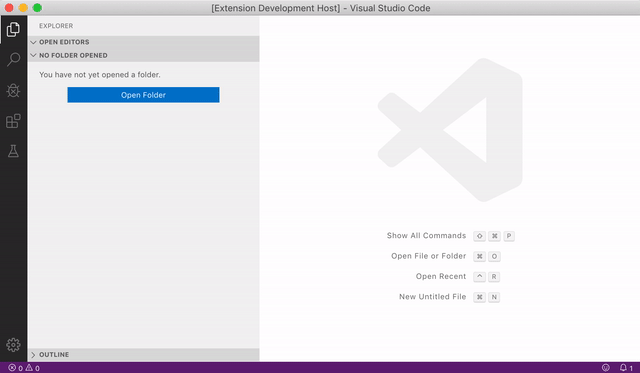
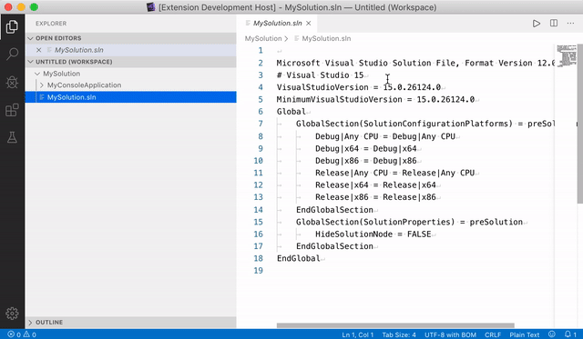
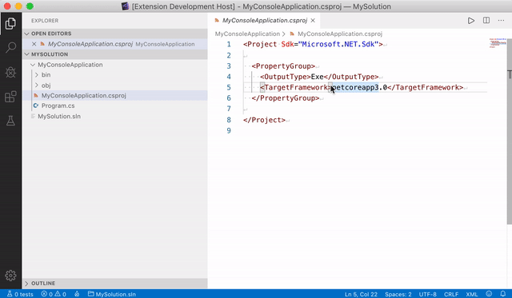
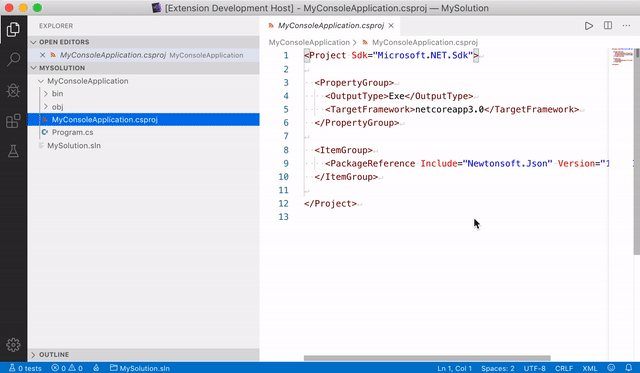

# dotnet, A Visual Studio Code extension

A modern interface to the dotnet & Entity Framework Core CLI for Visual Studio Code.

This extension provides access to the dotnet & EF CLI by using the Quick Pick UI. 

## Usage

* Open the command palette by pressing <kbd>Shift</kbd> + <kbd>&#8984;</kbd> + <kbd>P</kbd> or <kbd>F1</kbd>
* Start typing `dotnet` and choose your desired commmand

## Features

* Create dotnet objects like projects, solutions from templates (`dotnet new`)

* Add/Upgrade/Downgrade/Remove NuGet packages (`dotnet add package`, `dotnet remove package`)

* Add/Remove project-to-project references (`dotnet add reference`, `dotnet remove reference`)

* Add/Remove projects to/from solutions (`dotnet sln add`, `dotnet sln remove`) 

### Entity Framework Core

* Add/Remove migrations (`dotnet ef migrations add`, `dotnet ef migrations remove`) 

* List migrations (`dotnet ef migrations list`) 
 
* Update database (`dotnet ef database update`) 
  
* Show dbcontext info (`dotnet ef dbcontext info`) 